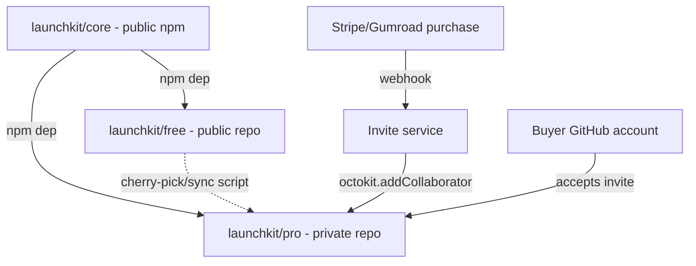
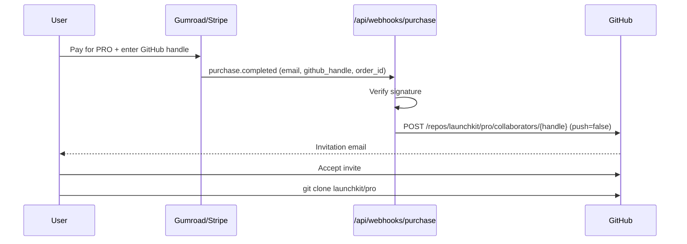
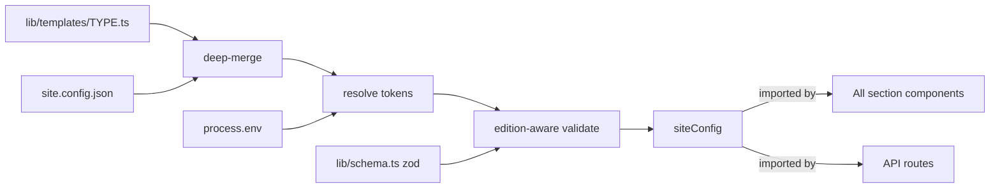

# LaunchKit Landing — FREE & PRO Edition Plan

Last updated: 2026-04-21
Owner: @bogdanmartinescu
Status: Draft for review

---

## 1. Executive summary

LaunchKit is a Next.js 16 + Tailwind v4 + shadcn/ui landing-page template with a wizard at [`app/setup/page.tsx`](app/setup/page.tsx) that writes [`lib/site.config.json`](lib/site.config.json). Today it ships 3 template types (ebook, SaaS, email-collection), Stripe one-time checkout, and partial wizard customization.

This plan turns LaunchKit into a two-edition product:

- **FREE** — public GitHub repo, MIT, 3 templates, Stripe-only, every section editable via wizard.
- **PRO** — private GitHub repo (buyer gets invited on purchase), superset of FREE: more templates, more section variants, more integrations, advanced checkout. Access = gate; no DRM.

Storage remains file-based (`site.config.json` + `/public/uploads`) as agreed.

Three product principles drive every UX decision (codified in [`CLAUDE.md`](CLAUDE.md) §2 invariants 4–6):

1. **Out-of-the-box deployable.** Every template ships with launch-ready demo content. `git clone && npm install && npm run dev` produces a credible page with zero edits.
2. **Progressive disclosure for customization.** Wizard fields are tiered Essentials / Common / Advanced (max 5 essentials per section). New options default to the most-hidden tier.
3. **Mobile-first responsive.** Designed at 375px first; verified at 375 / 768 / 1440. No horizontal scroll, ≥44 px tap targets, `prefers-reduced-motion` respected.

---

## 2. Architecture overview

```mermaid
flowchart LR
    subgraph wizard [Setup Wizard /setup]
        StepTemplate[Template picker]
        StepHero[Hero variant + theme]
        StepContent[Per-section content editor]
        StepBrand[Brand + images]
        StepIntegrations[Integrations]
    end

    subgraph apiAdmin [API admin routes]
        getConfig[GET /api/admin/get-config]
        saveConfig[POST /api/admin/save-config]
        upload[POST /api/admin/upload]
        testIntegration[POST /api/admin/test-integration]
    end

    subgraph config [Config layer]
        siteJson[lib/site.config.json]
        schema[lib/schema.ts zod]
        resolver[lib/config.ts merge+validate]
        templateDefaults[lib/templates/*.ts]
    end

    subgraph runtime [Runtime landing page /]
        pageRouter[app/page.tsx variant switch]
        sections[Section components]
        providers[Integration dispatchers]
    end

    subgraph integrations [lib/integrations]
        checkout[checkout/*]
        email[email/*]
        analytics[analytics/*]
        webhooks[webhooks/*]
    end

    wizard --> saveConfig
    wizard --> upload
    saveConfig --> siteJson
    upload -->|writes /public/uploads| siteJson
    getConfig --> siteJson
    testIntegration --> integrations

    siteJson --> resolver
    schema --> resolver
    templateDefaults --> resolver
    resolver --> sections
    resolver --> pageRouter
    pageRouter --> sections
    sections --> providers
    providers --> integrations
```



Key invariants:

1. Every string and every image URL on the rendered page resolves from `siteConfig.sections.<name>`. No copy is hard-coded in section components.
2. Secrets never live in `site.config.json` — secret fields store `"<env:KEY>"` placeholder tokens that [`lib/config.ts`](lib/config.ts) resolves from `process.env` at runtime.
3. PRO-only fields are validated out of the config on FREE builds by [`lib/schema.ts`](lib/schema.ts) based on `process.env.LAUNCHKIT_EDITION`.

---

## 3. FREE vs PRO split strategy

This section is the crux: how do we safely offer PRO without leaking it?

### 3.1 Options considered

| Option | Gate | Leak risk | Maintenance | Verdict |
|---|---|---|---|---|
| A. License-key check in a single public repo | `LAUNCHKIT_LICENSE_KEY` env var unlocks PRO code paths | High — PRO source is public, buyers and non-buyers alike can strip the check or just read the code | Low | Rejected — code is the product; public = free |
| B. Two totally separate repos | Access to private repo = the gate | Low | High — manual duplication, drift between editions | Rejected — drift will kill us |
| C. PRO extends FREE via git submodule | Access to private repo; FREE is a submodule inside PRO | Low | Medium — submodule UX is rough but sync is free | Viable |
| **D. PRO extends FREE via npm package (recommended)** | **Access to private repo; FREE core is published as `@launchkit/core` npm package consumed by PRO** | **Low** | **Low — clean upgrade via `npm update`, CI-tested contract** | **Recommended** |
| E. Monorepo with protected branches | `pro` branch is private-only | Medium — hard to prevent accidentally pushing PRO to public mirror | Medium | Rejected — branch-level privacy on GitHub requires a private repo with a separate public mirror, which is option B with extra steps |

### 3.2 Recommended architecture (Option D)

Three repos:

1. **`launchkit/core`** (public, MIT) — npm package containing:
   - The Next.js app scaffold is NOT in here; just reusable primitives.
   - Zod schema (`lib/schema.ts` equivalent)
   - Config resolver
   - Integration interfaces (`CheckoutProvider`, `EmailProvider`, `AnalyticsProvider`, `WebhookProvider`)
   - Shared section components that are in both editions
   - The `ImageUploadField`, `SectionRepeater`, other wizard primitives

2. **`launchkit/free`** (public, MIT) — the installable FREE app.
   - `package.json` depends on `@launchkit/core`
   - Ships 3 FREE templates (`ebook`, `saas`, `email-collection`)
   - Ships FREE integrations (Stripe one-time, email-none)
   - Ships the FREE wizard (steps 1–6)
   - This is what users `git clone`

3. **`launchkit/pro`** (private) — the PRO app.
   - `package.json` depends on `@launchkit/core`
   - Fork/superset of FREE; contains everything FREE has, plus:
     - 8 PRO templates
     - 14 PRO integrations
     - Expanded wizard (steps 7–10)
     - PRO-only sections
   - Buyers are invited here on purchase via GitHub API

**Why this works:**
- Buyers cannot access PRO code without a GitHub collaborator invite — the invite IS the license.
- Core updates flow to FREE and PRO via `npm update @launchkit/core`. No drift.
- A change to FREE-only code (e.g. a bug in the ebook template) is a PR to `launchkit/free`. PRO pulls it in either as an identical file (kept in sync via a script) or via a re-export. See 3.4.
- Open-source credibility: `launchkit/core` and `launchkit/free` are both public and inspectable.



### 3.3 Simpler v1 fallback: single-repo-split

If publishing `@launchkit/core` as an npm package is too much overhead for v1, collapse to **two repos**:

- `launchkit/free` — public.
- `launchkit/pro` — private. Contains the ENTIRE `launchkit/free` tree plus PRO additions. Synced from FREE via a scripted `git subtree pull`.

This is Option B done safely. Drift is managed by:

- `scripts/sync-from-free.sh` (in PRO): runs `git subtree pull --prefix=. git@github.com:launchkit/free main --squash`.
- A GitHub Action in PRO runs this script on a schedule and opens a PR with the result.

v1 = two-repo fallback. v2 = extract `@launchkit/core` once the interface surface stabilizes. The code written during Phase 1 is structured to make this extraction trivial (everything extractable lives under `lib/core/` already).

### 3.4 Purchase → access flow



Required infrastructure:
- A GitHub machine account with a fine-scoped PAT that can add collaborators to `launchkit/pro`.
- A tiny purchase-webhook endpoint. Hosted on the marketing site (which itself is built with LaunchKit PRO — dog-fooding).
- Buyer record stored in a simple JSON/SQLite file on the marketing site server for support.

### 3.5 Edition flag in code

A single env var `LAUNCHKIT_EDITION` drives:
- Template picker UI in `/setup` (PRO templates show with a lock icon in FREE).
- Which sections/integrations are imported at build time. Uses `next/dynamic` with a conditional import keyed on the edition flag so FREE builds tree-shake PRO code entirely.
- Whether the "Made with LaunchKit" footer credit renders.
- Schema validation — PRO-only fields are rejected in FREE.

```ts
// lib/edition.ts
export const EDITION = (process.env.LAUNCHKIT_EDITION ?? "free") as "free" | "pro";
export const isPro = EDITION === "pro";
```

---

## 4. Content-model architecture

### 4.1 Expanded `site.config.json` shape

```ts
{
  "edition": "free" | "pro",
  "configured": boolean,
  "templateType": TemplateType,
  "theme": "dark" | "light",
  "heroVariant": string,

  "brand": { name, primaryColor, accentColor, logoUrl, productImageUrl, ogImageUrl },

  "sections": {
    "navbar":        { enabled, variant, links: [{label, href}] },
    "hero":          { enabled, variant, eyebrow, headline, subheadline, ctaPrimary: {label, href}, ctaSecondary, image: {url, alt} },
    "trustedBy":     { enabled, variant, heading, logos: [{name, src, alt}] },
    "features":      { enabled, variant, heading, subheading, items: [{icon, title, body, highlight, image?}] },
    "stats":         { enabled, variant, items: [{value, label}] },
    "preview":       { enabled, variant, author, tocItems, bonusItems, screenshots: [{url, alt, caption}] },
    "pricing":       { enabled, variant, heading, tiers: [{name, price, period, features, isPopular, ctaLabel, stripePriceId}] },
    "testimonials":  { enabled, variant, heading, items: [{name, role, avatar, quote, stars, metric, videoUrl?}] },
    "faq":           { enabled, variant, heading, items: [{q, a}] },
    "newsletter":    { enabled, variant, heading, description, placeholder, ctaLabel },
    "ctaBand":       { enabled, variant, heading, body, ctaLabel },          // PRO
    "comparison":    { enabled, variant, columns, rows },                     // PRO
    "howItWorks":    { enabled, variant, steps: [{number, title, body, image}] }, // PRO
    "team":          { enabled, variant, members: [{name, role, bio, avatar, social}] }, // PRO
    "caseStudy":     { enabled, variant, title, body, metrics, images },      // PRO
    "blogTeaser":    { enabled, variant, posts: [{title, excerpt, image, href}] }, // PRO
    "footer":        { enabled, variant, columns, social, copyright }
  },

  "sectionOrder": ["hero", "trustedBy", "features", ...],

  "product":   { name, tagline, description, badge, price, originalPrice, currency, format, pages, chapters },
  "leadMagnet": { title, description, filePath },

  "integrations": {
    "checkout":  { provider, stripe: {...}, lemonsqueezy: {...}, paddle: {...} },
    "email":     { provider, apiKey, listId, audienceId },
    "analytics": { ga4Id, plausibleDomain, posthogKey },
    "webhooks":  { discord, slack, zapier, notion, airtable },
    "seo":       { title, description, ogImageUrl, twitterHandle }
  },

  "pro": { removeBranding: boolean, customCss: string }
}
```

### 4.2 Config resolution pipeline



Failure modes:
- Missing required field on a user-selected section variant: warn in dev overlay, substitute template default.
- Invalid PRO field on FREE build: strip + log `[config] ignored PRO field "sections.team" on FREE edition`.
- `<env:KEY>` token with no env var set: empty string in build, dev-overlay warning at page load.

---

## 5. Feature matrix (FREE vs PRO)

### 5.1 Templates (product types)

| Template | FREE | PRO |
|---|:---:|:---:|
| ebook — digital download | yes | yes |
| saas — software product | yes | yes |
| email-collection — lead magnet | yes | yes |
| course — video course / cohort | | yes |
| agency — service business | | yes |
| portfolio — creator / freelancer | | yes |
| waitlist — pre-launch | | yes |
| event — conference / workshop | | yes |
| physical — physical product | | yes |
| consulting — booking / 1:1 | | yes |
| app — mobile app download | | yes |

### 5.2 Sections (all editable via wizard, text + images)

| Section | FREE variants | PRO variants |
|---|---|---|
| Navbar | 1 | 3 (minimal, centered-logo, with-CTA) |
| Hero | 2 per template | 4+ per template |
| TrustedBy | 1 | 3 (marquee, grid, with-quotes) |
| Features | 1 | 4 (grid, bento, alternating, accordion) |
| Stats / social proof | 1 | 2 (counter, comparison) |
| Product preview | 1 (ebook only) | 3 (carousel, tabs, video embed) |
| Pricing | 1 per template | 3 (3-tier, toggle monthly/yearly, comparison grid) |
| Testimonials | 1 | 4 (3-col, carousel, video, logo+quote) |
| FAQ | 1 | 2 (accordion, 2-column) |
| Newsletter | 1 | 2 (inline, banner) |
| CTA band | — | yes |
| Comparison table | — | yes |
| How-it-works | — | yes |
| Team / About | — | yes |
| Case study | — | yes |
| Blog teaser | — | yes |
| Footer | 1 | 3 (compact, fat w/ columns, minimal) |

### 5.3 Wizard customization

| Capability | FREE | PRO |
|---|:---:|:---:|
| Brand name, product name, tagline, description | yes | yes |
| Logo + product image upload | yes | yes |
| Edit hero copy, CTAs, badge | yes | yes |
| Edit all section items (features list, testimonials, FAQ, stats, nav, footer) | yes (read-only on some) | yes fully editable |
| Per-section image uploads (testimonial avatars, feature icons, logos, screenshots, OG) | hero + product only | all |
| Section ordering (drag-to-reorder) | — | yes |
| Toggle sections on/off | — | yes |
| Switch section variant | — | yes |
| Live preview pane | — | yes |
| Export/import config | — | yes |

### 5.4 Integrations

| Integration | FREE | PRO |
|---|:---:|:---:|
| Stripe Checkout (one-time) | yes | yes |
| Stripe subscriptions + customer portal | — | yes |
| LemonSqueezy | — | yes |
| Paddle | — | yes |
| Multi-currency + coupon codes | — | yes |
| Order bumps / upsells | — | yes |
| Email → console log | yes | yes |
| Resend | — | yes |
| Mailchimp | — | yes |
| ConvertKit / Kit | — | yes |
| Loops | — | yes |
| GA4 | — | yes |
| Plausible / Fathom | — | yes |
| PostHog | — | yes |
| Discord webhook | — | yes |
| Slack webhook | — | yes |
| Generic / Zapier webhook | — | yes |
| Notion / Airtable | — | yes |

---

## 6. Repository structure

Target file tree (after Phase 1–5 ship):

```
├── lib/
│   ├── schema.ts                          # NEW zod schema + types
│   ├── edition.ts                         # NEW edition flag helper
│   ├── config.ts                          # rewritten resolver
│   ├── site.config.json                   # expanded shape
│   ├── templates/
│   │   ├── ebook.ts
│   │   ├── saas.ts
│   │   ├── email-collection.ts
│   │   ├── course.ts                      # PRO
│   │   ├── agency.ts                      # PRO
│   │   ├── portfolio.ts                   # PRO
│   │   ├── waitlist.ts                    # PRO
│   │   ├── event.ts                       # PRO
│   │   ├── physical.ts                    # PRO
│   │   ├── consulting.ts                  # PRO
│   │   └── app.ts                         # PRO
│   ├── integrations/
│   │   ├── index.ts                       # provider registry
│   │   ├── types.ts                       # shared interfaces
│   │   ├── checkout/
│   │   │   ├── stripe.ts
│   │   │   ├── stripe-subscription.ts     # PRO
│   │   │   ├── lemonsqueezy.ts            # PRO
│   │   │   └── paddle.ts                  # PRO
│   │   ├── email/
│   │   │   ├── none.ts
│   │   │   ├── resend.ts                  # PRO
│   │   │   ├── mailchimp.ts               # PRO
│   │   │   ├── convertkit.ts              # PRO
│   │   │   └── loops.ts                   # PRO
│   │   ├── analytics/
│   │   │   ├── ga4.ts                     # PRO
│   │   │   ├── plausible.ts               # PRO
│   │   │   ├── fathom.ts                  # PRO
│   │   │   └── posthog.ts                 # PRO
│   │   └── webhooks/
│   │       ├── discord.ts                 # PRO
│   │       ├── slack.ts                   # PRO
│   │       ├── notion.ts                  # PRO
│   │       └── generic.ts                 # PRO
│   └── core/                              # future @launchkit/core extraction target
├── components/
│   ├── sections/
│   │   ├── shared/                        # cross-template sections
│   │   │   ├── Navbar.tsx
│   │   │   ├── TrustedBy.tsx
│   │   │   ├── Testimonials.tsx
│   │   │   ├── FAQ.tsx
│   │   │   ├── Newsletter.tsx
│   │   │   ├── Footer.tsx
│   │   │   ├── CtaBand.tsx                # PRO
│   │   │   ├── Comparison.tsx             # PRO
│   │   │   ├── HowItWorks.tsx             # PRO
│   │   │   ├── Team.tsx                   # PRO
│   │   │   ├── CaseStudy.tsx              # PRO
│   │   │   └── BlogTeaser.tsx             # PRO
│   │   ├── ebook/
│   │   ├── saas/
│   │   ├── email/
│   │   ├── course/                        # PRO
│   │   ├── agency/                        # PRO
│   │   ├── portfolio/                     # PRO
│   │   ├── waitlist/                      # PRO
│   │   ├── event/                         # PRO
│   │   ├── physical/                      # PRO
│   │   ├── consulting/                    # PRO
│   │   └── app/                           # PRO
│   └── setup/
│       ├── PreviewPane.tsx                # NEW live preview
│       ├── SectionRepeater.tsx            # NEW per-section content editor
│       ├── IntegrationCard.tsx            # NEW
│       └── ProLockBadge.tsx               # NEW
├── app/
│   ├── api/
│   │   ├── admin/
│   │   │   ├── get-config/route.ts
│   │   │   ├── save-config/route.ts
│   │   │   ├── upload/route.ts
│   │   │   └── test-integration/route.ts  # NEW
│   │   ├── checkout/route.ts              # becomes dispatcher
│   │   ├── email-signup/route.ts          # becomes dispatcher
│   │   ├── webhooks/
│   │   │   ├── stripe/route.ts            # PRO
│   │   │   ├── lemonsqueezy/route.ts      # PRO
│   │   │   └── paddle/route.ts            # PRO
│   │   └── billing/
│   │       └── portal/route.ts            # PRO
│   ├── setup/page.tsx                     # major expansion
│   ├── success/page.tsx
│   └── cancel/page.tsx
└── scripts/
    ├── migrate-config.ts                  # NEW v1→v2 migration
    ├── sync-from-free.sh                  # PRO repo only
    └── upgrade-to-pro.ts                  # PRO repo only
```

---

## 7. Wizard redesign

Today [`app/setup/page.tsx`](app/setup/page.tsx) has 5 steps. Expanded:

**Tiering** — every step uses the Essentials / Common / Advanced tier model from [`CLAUDE.md`](CLAUDE.md) §9.1. Each step shows ≤5 Essentials fields by default; everything else is one click away under "Show more" or two clicks away under "Advanced".

Each step also includes a "Use defaults & finish" shortcut so users can deploy with template defaults at any point.

### FREE wizard (6 steps)

1. **Template** — FREE types selectable; PRO types visible with lock icon + link to upgrade page.
2. **Hero style + theme** — variant picker (Common), light/dark toggle (Essential).
3. **Product** — Essentials: name, tagline, primary CTA label. Common: description, price, badge. Advanced: original price, format, page count.
4. **Branding** — Essentials: brand name, primary color, logo. Common: accent color, hero/product image, OG image. Advanced: theme overrides, custom CSS variables.
5. **Copy** — Essentials: hero headline. Common: subheadline, secondary CTA, newsletter blurb. Advanced: per-FAQ override, custom nav anchors.
6. **Integrations** — Essentials: Stripe publishable key + price ID. Common: base URL, success/cancel URLs. Advanced: webhook secret, currency overrides.

### PRO wizard (10 steps total — adds 4)

7. **Sections** — Essentials: toggle on/off. Common: drag-to-reorder (`@dnd-kit/sortable`), variant picker per section. Advanced: per-section animation toggle, custom section ID.
8. **Section content** — per-section repeater UIs backed by [`components/setup/SectionRepeater.tsx`](components/setup/SectionRepeater.tsx): features list, testimonials (w/ avatar uploads), FAQ, pricing tiers, stats, nav, footer columns, team, case study, how-it-works, comparison. Each repeater item itself uses Essentials/Common/Advanced tiering.
9. **Integrations+** — Essentials: provider pickers (email, analytics, checkout). Common: credentials + Test Connection button. Advanced: webhook URLs, raw provider options, multi-currency mapping.
10. **Finish** — current step + export/import config buttons + "Reset entire site" with typed confirmation.

### New wizard components

- **Live preview pane** — desktop-only iframe on the right. Posts wizard state to the iframe via `postMessage`; iframe renders `/preview?edition=pro`, which reads posted state as a fallback to `site.config.json`.
- **PRO lock badge** — `<ProLockBadge />` wraps any PRO-only field on FREE, showing a lock icon + "Upgrade to PRO" tooltip.
- **Env-token input** — for secrets: the input accepts either a literal value (converted to `"<env:NAME>"` on save, with an emitted `.env.local` snippet) or a reference to an existing env var.

---

## 8. Action plan / phases

Each phase is independently shippable. Phases 1, 2, and 5a benefit FREE users immediately.

### Phase 1 — Content-model refactor (foundation) ✅ SHIPPED
Edition: FREE + PRO | Effort: L | Priority: blocks everything

- [x] Add `zod` dep and define full schema in [`lib/schema.ts`](lib/schema.ts).
- [x] Write [`lib/edition.ts`](lib/edition.ts) helper.
- [x] Migrate hard-coded copy out of each section component into per-section defaults in [`lib/templates/*.ts`](lib/templates/). Shipped: `ebook`, `saas`, `email-collection`, `mobile-app`.
- [x] Rewrite [`lib/config.ts`](lib/config.ts) to deep-merge defaults + JSON + resolve env tokens + validate.
- [x] Refactor every section component in [`components/sections/`](components/sections/) to read from `siteConfig.sections.<name>` only.
- [x] Write [`scripts/migrate-config.ts`](scripts/migrate-config.ts) + in-memory legacy migration in `lib/config.ts`.
- [ ] Add `postinstall` hook that runs the migration if it detects a v1 config. _(Deferred: `npm run migrate` is explicit.)_
- [x] Update [`app/api/admin/save-config/route.ts`](app/api/admin/save-config/route.ts) to validate against the new schema before writing.

**Also shipped (scope creep, in a good way):**
- Light-theme contrast safety net in [`app/globals.css`](app/globals.css).
- Brand-token sweep — every hardcoded `indigo-*` / `violet-*` replaced with `var(--brand-primary)` / `var(--brand-accent)`.
- Graceful checkout degradation: demo success page when Stripe isn't configured.
- Fourth template type: `mobile-app` with 5 bespoke sections (HeroMobile, AppDownloadCTA, AppScreenshots, HowItWorks, FeatureShowcase alternating rows, PremiumPricing) + self-hosted App Store / Google Play SVG badges.

**Exit criteria:** ✅ FREE site renders from 100% config-driven content. `npm run build` succeeds on both `LAUNCHKIT_EDITION=free` and `=pro`.

### Phase 2 — Expanded FREE wizard
Edition: FREE | Effort: M

- [ ] Add "Copy" step (step 5) with textareas for hero headline, CTAs, newsletter, FAQ.
- [ ] Implement [`components/setup/PreviewPane.tsx`](components/setup/PreviewPane.tsx) with `postMessage` bridge.
- [ ] Add OG image upload field to the Branding step.
- [ ] Wire `ImageUploadField` to all remaining FREE image slots (any missing testimonial avatars, logo-strip logos that are surfaced to FREE).

**Exit criteria:** a FREE user can produce a launch-ready site without opening any `.ts` file.

### Phase 3 — Integrations foundation ✅ FREE-SIDE SHIPPED
Edition: FREE (refactor) + PRO (new providers) | Effort: L

- [x] Define interfaces in [`lib/integrations/types.ts`](lib/integrations/types.ts): `CheckoutProvider`, `EmailProvider`, `AnalyticsProvider`, `WebhookProvider` + `IntegrationError`.
- [x] Build [`lib/integrations/catalog.ts`](lib/integrations/catalog.ts) + [`lib/integrations/registry.ts`](lib/integrations/registry.ts) — edition-aware registry with dynamic imports.
- [x] Refactor [`app/api/checkout/route.ts`](app/api/checkout/route.ts) → dispatcher using registry.
- [x] Refactor [`app/api/email-signup/route.ts`](app/api/email-signup/route.ts) → dispatcher.
- [x] Build [`app/api/admin/test-integration/route.ts`](app/api/admin/test-integration/route.ts).
- [x] Ship FREE providers: [`lib/integrations/checkout/stripe.ts`](lib/integrations/checkout/stripe.ts), [`lib/integrations/email/none.ts`](lib/integrations/email/none.ts).
- [x] Wizard provider-picker cards with PRO-locked states + per-provider Test button.
- [ ] Ship PRO providers in the private `launchkit/pro` repo (one PR per provider, each with unit test hitting a mocked SDK): Resend, Mailchimp, ConvertKit, Loops, GA4, Plausible, Fathom, PostHog, Discord, Slack, generic-webhook, Notion, Airtable. _(Live in PRO repo only; the catalog + registry in FREE already knows they exist and gates access.)_
- [ ] Build `<LayoutScripts>` client component that auto-injects analytics snippets from `siteConfig.integrations.analytics`. _(Deferred: analytics providers are PRO-only; wire up alongside PRO provider code.)_

**PRO-provider drop-in contract** (for use inside the private `launchkit/pro` repo):
- File path: `lib/integrations/pro/<kind>/<id>.ts`.
- Exported name: camelCase of `<id>-<kind>` (e.g. `convertkit-email` → `convertkitEmail`).
- Export shape: a single object that implements the matching interface from `types.ts`.
- Reads secrets from `process.env`. Never throws — returns `{ ok: false, message }` from `testConnection` instead.
- The registry's `loadProModule()` dynamic-imports on-demand; no static registration required.

**Context7 note:** fetch current SDK docs for every PRO provider at implementation time — Stripe, Resend, LemonSqueezy, Paddle, and PostHog have all shipped breaking changes recently. This is covered by the user rule.

**Exit criteria:** ✅ FREE: `/api/email-signup` and `/api/checkout` dispatch through the registry. `/api/admin/test-integration` returns health-check results. Wizard shows provider cards with PRO-locked states. Remaining: implement PRO providers in the private repo.

### Phase 4 — PRO sections & variants
Edition: PRO | Effort: L

- [ ] Implement variant components: Features bento/alternating/accordion, Pricing comparison-grid + monthly/yearly toggle, Testimonials carousel/video/logo+quote, FAQ 2-column, etc.
- [ ] Implement PRO-only sections: CtaBand, Comparison, HowItWorks, Team, CaseStudy, BlogTeaser.
- [ ] Implement wizard Sections step: drag-to-reorder (`@dnd-kit/sortable`), enable/disable, variant picker.
- [ ] Implement wizard Section-Content step: `SectionRepeater` + image slots for every list-style field.

### Phase 5 — PRO templates
Edition: PRO | Effort: XL (1 template ≈ 0.5–1 day)

Order: `waitlist` (simplest, validates the flow) → `course` → `agency` → `portfolio` → `event` → `physical` → `consulting` → `app`.

Per template:
- Components: `Hero.tsx` + 2–3 variants, `Features.tsx`, `Pricing.tsx` (if applicable), template-specific sections.
- `lib/templates/<type>.ts` with a polished default content set.
- Wizard picker entry + a marketing screenshot.

**Exit criteria per template:** `npm run dev` with that template selected produces a complete, typographically polished page with zero user edits.

### Phase 6 — Advanced checkout
Edition: PRO | Effort: M

- [ ] `checkout/stripe-subscription.ts` + [`app/api/billing/portal/route.ts`](app/api/billing/portal/route.ts).
- [ ] `checkout/lemonsqueezy.ts` + [`app/api/webhooks/lemonsqueezy/route.ts`](app/api/webhooks/lemonsqueezy/route.ts).
- [ ] `checkout/paddle.ts` + [`app/api/webhooks/paddle/route.ts`](app/api/webhooks/paddle/route.ts).
- [ ] Pricing section: monthly/yearly toggle variant (pairs of `priceId`).
- [ ] Coupon code support via `?coupon=` URL param.
- [ ] Order bumps / upsells on [`app/success/page.tsx`](app/success/page.tsx).
- [ ] Multi-currency dropdown in pricing section.

### Phase 7 — Distribution & licensing
Edition: both | Effort: M

- [ ] Create private `launchkit/pro` repo. Copy current FREE tree as initial commit.
- [ ] Add `scripts/sync-from-free.sh` to PRO repo + GitHub Action that runs weekly and opens a sync PR.
- [ ] Build `scripts/upgrade-to-pro.ts` in PRO repo: reads v2 FREE config, fills in PRO-only defaults.
- [ ] Stand up purchase webhook — cloud function on marketing site that calls `octokit.repos.addCollaborator`.
- [ ] Publish marketing site (dog-food LaunchKit PRO to build it).
- [ ] Docs site at `/docs` covering wizard, sections, integrations, checkout, and the FREE→PRO upgrade.

### Phase 8 — Polish & launch (optional, post-v1)

- [ ] Extract `@launchkit/core` npm package (Option D from 3.2).
- [ ] OG image generator route (PRO) — runtime image at `/api/og` using `@vercel/og`.
- [ ] AI copy generator for sections (PRO).
- [ ] A/B testing on hero/pricing (PRO).
- [ ] Analytics dashboard (PRO).

---

## 9. Distribution & licensing details

### FREE
- License: MIT.
- Repo: `launchkit/free` public on GitHub.
- Footer credit: `<FooterCredit />` component renders "Made with LaunchKit" linking to the marketing site. Cannot be removed in FREE (soft rule: we ask, don't enforce).
- `LICENSE` file + `README.md` + `AGENTS.md` + `CLAUDE.md` all included.

### PRO
- License: commercial, single-project or unlimited-projects tiers (decide at launch).
- Repo: `launchkit/pro` private on GitHub.
- Purchase → GitHub collaborator invite to buyer's handle (they enter it at checkout).
- PRO build reads `LAUNCHKIT_EDITION=pro` from env; PRO templates/integrations are only then loaded.
- `<FooterCredit />` hides when `siteConfig.pro.removeBranding === true`.
- Buyers receive a single LICENSE.md with their name + order ID templated in at invite time (via a tiny PR bot).

### Why this is safe
- PRO source is never public. The only way to read it is to be invited to the private repo.
- Leaks can happen (a buyer re-uploads), but this is the same risk shape as Tailwind UI, ShipFast, MakerKit, and every similar product. It's industry-standard and acceptable.
- No runtime license server means zero support burden and zero offline-usage problems.

---

## 10. Risks & open questions

| Risk | Mitigation |
|---|---|
| Wizard bloat — too many fields drown the user | Progressive disclosure: "Advanced" collapsibles per step; sensible defaults. PRO adds steps but doesn't move FREE steps. |
| `site.config.json` becomes huge and fragile | Zod validation in save-config + clear error messages; wizard is the primary editor. |
| PRO/FREE code drift | Weekly automated sync PR (Phase 7); Phase 8 extraction of `@launchkit/core` removes most drift surface. |
| Secret leakage via committed config | `<env:KEY>` token scheme (section 2, invariant 3) + wizard emits `.env.local` snippet on save, never writes real secrets. |
| Bundle bloat from all PRO code | `LAUNCHKIT_EDITION=free` build uses `next/dynamic` + conditional imports so PRO code is tree-shaken. Verify with `next build --debug` + `du -sh .next`. |
| Framer Motion / Next 16 / React 19 breaking changes | Pin versions, consult `node_modules/next/dist/docs/` per [`AGENTS.md`](AGENTS.md), pull current docs via Context7 at each phase's start. |
| Buyer leaks PRO repo publicly | Acceptable industry risk. Monitor via Google + GitHub search on repo fingerprint strings; DMCA as needed. |

### Open questions to resolve before Phase 1

1. **Storefront**: Stripe Checkout, Gumroad, or LemonSqueezy for selling PRO itself? Stripe gives best margins + same infra as the product; Gumroad gives simplest buyer UX.
2. **Pricing**: single-project $99 / unlimited-projects $299? Or one price?
3. **v1 split strategy**: go with 3.3 two-repo fallback for speed, or do 3.2 three-repo from day one?
4. **Hosting of purchase webhook**: Vercel function on marketing site, or separate tiny service?

---

## 11. Definition of done

### FREE v1.0 ships when
- All 3 current templates render from 100% config-driven content (Phase 1).
- Wizard produces a launch-ready site without any code edits (Phase 2).
- Stripe one-time checkout works end-to-end from wizard config (Phase 3 partial).
- Every template renders cleanly with zero edits (out-of-the-box invariant).
- Every section verified at 375 / 768 / 1440 viewports with no horizontal scroll, ≥44 px tap targets, WCAG AA contrast on both themes.
- Every wizard step caps Essentials at ≤5 fields; everything else is Common or Advanced.
- [`README.md`](README.md) covers: clone → wizard → deploy.
- `launchkit/free` repo is published on GitHub under MIT.

### PRO v1.0 ships when
- At least 6 PRO templates shipped and polished, each with launch-ready demo content (Phase 5).
- Every shared section has at least 2 variants; PRO-only sections all present (Phase 4).
- At least 3 email providers + 2 checkout providers + 2 analytics providers working and testable from the wizard (Phase 3).
- Subscriptions, coupons, multi-currency, and one upsell path live (Phase 6).
- Purchase → private-repo invite automation works end-to-end (Phase 7).
- FREE→PRO migration script upgrades a FREE config without data loss.
- All 8+ PRO templates pass the same responsive + zero-edits checks as FREE.
- Wizard's 4 PRO steps respect tier limits (Essentials/Common/Advanced).

---

## 12. Immediate next step

Start Phase 1 — the content-model refactor — because it unlocks every subsequent phase and ships immediate value to FREE users. Specifically, the first slice is:

1. Draft [`lib/schema.ts`](lib/schema.ts) as the single source of truth for the config shape.
2. Draft [`lib/edition.ts`](lib/edition.ts).
3. Rewrite [`lib/config.ts`](lib/config.ts) to validate + merge + resolve env tokens.
4. Write `scripts/migrate-config.ts` and run it against the existing [`lib/site.config.json`](lib/site.config.json).
5. Refactor [`components/sections/Hero.tsx`](components/sections/Hero.tsx) first as the proof of concept; once green, do the rest.

After that slice, the wizard changes in Phase 2 are mostly additive and low-risk.
